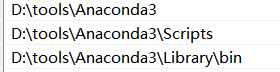

# anaconda的安装与环境配置(Windows)

## 1.下载
1.官网下载  
[https://www.anaconda.com/distribution/](https://www.anaconda.com/distribution/)

2.镜像下载  
[https://mirrors.tuna.tsinghua.edu.cn/anaconda/archive/](https://mirrors.tuna.tsinghua.edu.cn/anaconda/archive/)

## 2.安装
  
  
  

## 3.配置环境变量
此电脑—右键—高级系统设置—环境变量—系统变量—双击path—新建  
  

## 4.检查
输入conda后，正常显示
 

## 5.更新
更新升级工具包 `conda upgrade --all`