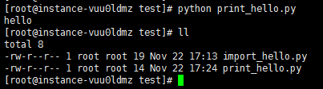
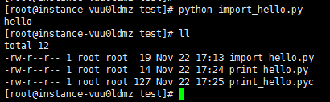

### Python在什么时候会生成pyc文件呢？
事情大概是这样的，之前我一直以为python文件在执行过之后就会生成pyc文件，后来一次偶然情况下，发现还是自己too young too simple,在看过其他大神文章并且自己验证之后，发现还是有点意思的，权当没事写点文章吧。

### 什么是pyc文件呢？
  简单来说，pyc文件就是Python的字节码文件，我们都知道Python是一种全平台的解释性语言，全平台其实就是Python文件在经过解释器解释之后（或者称为编译）生成的pyc文件可以在多个平台下运行，这样同样也可以隐藏源代码。其实，Python是完全面向对象的语言，Python文件在经过解释器解释后生成字节码对象PyCodeObject，pyc文件可以理解为是PyCodeObject对象的持久化保存方式。

### 什么时候会生成pyc文件呢？
pyc文件只有在文件被当成模块导入时才会生成。也就是说，Python解释器认为，只有import进行的模块才需要被重用。 生成pyc文件的好处显而易见，当我们多次运行程序时，不需要重新对该模块进行重新的解释。主文件一般只需要加载一次不会被其他模块导入，所以一般主文件不会生成pyc文件。

下面来举个例子说明，见代码
```
文件print_hello.py

print "hello"
```
```
文件import_hello.py

import print_hello
```

执行`python print_hello.py `
  
可以发现并没有pyc文件生成

执行`python import_hello.py`
  
发现生成了pyc文件

需要说明两点的是：
- 1.执行`python import_hello.py`，开始执行`import print_hello`，导入print_hello模块，然后执行了print_hello模块里面的代码，所以我们可以看到有“hello”输出；
- 2.如果不想执行里面的代码，一般可以将代码封装在一个类或者函数里面，然后加个if判断，类似下面这样，表示如果是被导入则不执行if下的代码，如果作为程序入口或者脚本执行，则执行if下的代码。
```
if __name__ == "__main__":
    print("hello")
```


### pyc文件的过期时间
在生成pyc文件的同时，写入了一个Long型的变量，用于记录最近修改的时间；
每次载入之前都先检查一下py文件和pyc文件的最后修改日期，如果不一致则会生成一个新的pyc文件